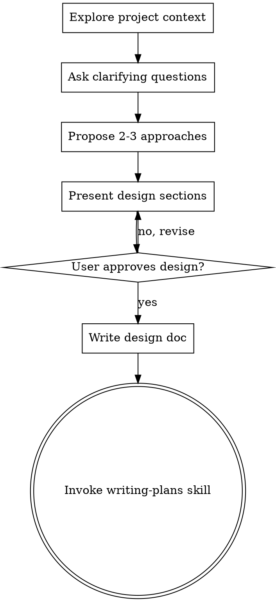

> **Adapted from [obra/superpowers](https://github.com/obra/superpowers/blob/main/skills/brainstorming/SKILL.md)** — core flow and HARD-GATE concept. This version adds Visual Companion (A/B diagrams for architecture decisions) and spec-review-checklist for audit integration.

# Brainstorming Ideas Into Designs

## Overview

Help turn ideas into fully formed designs and specs through natural collaborative dialogue.

Start by understanding the current project context, then ask questions one at a time to refine the idea. Once you understand what you're building, present the design and get user approval.

<HARD-GATE>
Do NOT invoke any implementation skill, write any code, scaffold any project, or take any implementation action until you have presented a design and the user has approved it. This applies to EVERY project regardless of perceived simplicity.
</HARD-GATE>

## Anti-Pattern: "This Is Too Simple To Need A Design"

Every project goes through this process. A todo list, a single-function utility, a config change — all of them. "Simple" projects are where unexamined assumptions cause the most wasted work. The design can be short (a few sentences for truly simple projects), but you MUST present it and get approval.

## Checklist

You MUST create a task for each of these items and complete them in order:

1. **Explore project context** — check files, docs, recent commits
2. **Ask clarifying questions** — one at a time, understand purpose/constraints/success criteria
3. **Propose 2-3 approaches** — with trade-offs and your recommendation
   - **[Visual Check]** 方案涉及架构/数据流/UI/多组件？→ 生成 A/B 对比可视化（见下方 Visual Companion 段）并 `open` 给用户看
4. **Present design** — in sections scaled to their complexity, get user approval after each section
   - **[Visual Check]** 设计涉及组件关系/状态流转/数据管道？→ 生成架构图/流程图并 `open` 给用户看
5. **Run spec review** — internally validate completeness/consistency, auto-generate Review Checklist (see Spec Review section)
6. **Write design doc** — save to Obsidian `01-项目开发/02-项目设计/{项目名}/YYYY-MM-DD-<topic>-design.md`，包含 Review Checklist 段落
7. **Transition to implementation** — invoke writing-plans skill to create implementation plan

## Process Flow



**The terminal state is invoking writing-plans.** Do NOT invoke frontend-design, mcp-builder, or any other implementation skill. The ONLY skill you invoke after brainstorming is writing-plans.

## The Process

**Understanding the idea:**
- Check out the current project state first (files, docs, recent commits)
- Ask questions one at a time to refine the idea
- Prefer multiple choice questions when possible, but open-ended is fine too
- Only one question per message - if a topic needs more exploration, break it into multiple questions
- Focus on understanding: purpose, constraints, success criteria

**Exploring approaches:**
- Propose 2-3 different approaches with trade-offs
- Present options conversationally with your recommendation and reasoning
- Lead with your recommended option and explain why

**Presenting the design:**
- Once you believe you understand what you're building, present the design
- Scale each section to its complexity: a few sentences if straightforward, up to 200-300 words if nuanced
- Ask after each section whether it looks right so far
- Cover: architecture, components, data flow, error handling, testing
- Be ready to go back and clarify if something doesn't make sense

## After the Design

**Documentation:**
- Write the validated design to `docs/plans/YYYY-MM-DD-<topic>-design.md`
- Use elements-of-style:writing-clearly-and-concisely skill if available
- Commit the design document to git

**Implementation:**
- Invoke the writing-plans skill to create a detailed implementation plan
- Do NOT invoke any other skill. writing-plans is the next step.

## Visual Companion (Checklist Step 3/4 自动判断)

**已嵌入 Checklist 的 [Visual Check] 节点。** 走到 Step 3 或 Step 4 时，自动判断：

> "Would the user understand this better by seeing it than reading it?"

**YES 的场景（必须生成）**：
- 2+ 组件/服务的交互关系 → 架构图（Mermaid）
- A/B 方案各有 3+ 条 pros/cons → 对比可视化
- 数据经过 3+ 步变换 → 数据流图
- UI 布局讨论 → Wireframe mockup

**NO 的场景（跳过）**：
- 单文件配置变更
- 单函数修改
- 纯逻辑讨论（没有空间/结构维度）

生成后用 `open /tmp/brainstorm-visuals/<timestamp>-<topic>.html` 直接在浏览器打开。
HTML 模板见 `visual-companion.md`。

---

## Spec Review & Checklist Generation

After Step 4 (design approved), before Step 5 (write design doc):

1. Run the spec review checklist (`spec-review-checklist.md`) internally
2. Only surface issues to user if real blockers found
3. **Auto-generate a Review Checklist** and append it to the design doc

The Review Checklist threads through to PUA Phase 3+4 code review — reviewers verify the implementation against these checklist items. This ensures brainstorming decisions are tracked all the way to completion.

```markdown
## Review Checklist (auto-generated)
- [ ] {component}: {responsibility} — implemented as specified
- [ ] Data flow: {source} → {destination} — matches spec
- [ ] Error handling: {strategy} — implemented
- [ ] Quality gate: {measurable_criterion}
- [ ] Edge case: {case} — handled
```

---

## Key Principles

- **One question at a time** - Don't overwhelm with multiple questions
- **Multiple choice preferred** - Easier to answer than open-ended when possible
- **YAGNI ruthlessly** - Remove unnecessary features from all designs
- **Explore alternatives** - Always propose 2-3 approaches before settling
- **Incremental validation** - Present design, get approval before moving on
- **Be flexible** - Go back and clarify when something doesn't make sense
